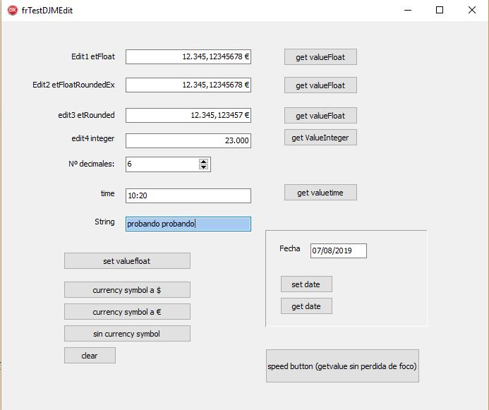
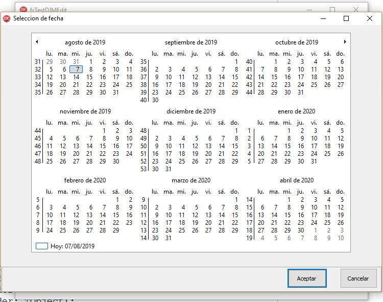
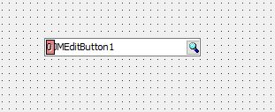

# Componentes para Delphi VCL: TDJMEdit y TDJMEditButton

# TDJMEdit



Heredado de TEdit, sirve para:

- strings
- fechas
- números
- tiempo (hh:mm)

> **IMPORTANTE!!! PUEDES PROBARLO SIN NECESIDAD DE INSTALARLO, INCLUYE DEMO!!**

Se incluye paquetes para instalarlo en Delphi XE2 y para instalarlo en Delphi Berlin **y Delphi Alexandria**. Cualquier otra versión superior a XE2 no debe dar mayor problema. Con la versión Delphi 7 no funciona (tiene cosas del lenguaje que Delphi 7 no tiene)

# La demo
Los proyectos de test crean los componentes en tiempo de ejecución, así que puedes probarlo sin necesidad de instalar el componente. Son los proyectos de los directorios *TestBerlin*,  *TestXE2* y *TestAlexandria*

# Características y propiedades

# editType
Evidentemente, la propiedad más importante:

- **etString** el Edit actúa como un edit de texto, normal
- **etInteger** solamente acepta números enteros, (ver más adelante la sección formato de números).
- **etFloat** admite números con decimales. Los que sean, no redondea, no corta decimales, deja el número tal y como haya sido tecleado
- **etFloatRounded** admite números con decimales. Redondea (y rellena) a **decimals** decimales.
- **etFloatRoundedEx** como *etFloatRounded* pero **si el número tiene más decimales de lo indicado en **decimals**, no redondea.
- **etDate** admite fechas
- **etTime** admite horas:minutos
 

**por favor, sigue leyendo para ver las diferencias entre los distintos tipos de Edit**

# etFloat, etFloatRounded y etFloatRoundedEx
Quizás sea la característica de este componente que lo diferencie de los otros cientos de componentes que puedas encontrar en internet.

**etFloat** Respeta todos los decimales que tenga el número. "no le hace nada"

```
//nº = 1234,123713279123 -> 1234,123713279123
//nº = 1234,1237         -> 1234,1237
```
                
**etFloatRounded** redondea a "decimals" decimales. Si el número tiene menos, añade los necesarios.

```
//nº = 1234,123713279123, decimals = 3 -> 1234,124
//nº = 1234,12,           decimals = 3 -> 1234,120
```     

**etFloatRoundedEx** como etFloatRounded pero si el nº tiene más decimales, no lo corta/redondea

```
//nº = 1234,123713279123, decimals = 3 -> 1234,123713279123
//nº = 1234,12,           decimals = 3 -> 1234,120
```

el uso de etFloatRoundedEx está pensado para trabajar por ejemplo con tres decimales, que el usuario teclee normalmente tres decimales y hasta ahí, sea como etFloatRounded, pero si, por ejemplo; estamos visualizando datos grabados en la base de datos y hubiera algún importe con más de tres decimales, que no lo redondee. Esta es la diferencia. Es algo así como 'vamos a trabajar con x decimales, pero si tuvieramos alguno mal guardado, lo vamos a visualizar, no vamos a engañar al usuario'. Es un concepto importante. Yo soy de la opinión de mostrar en pantalla siempre lo que tenga en la base de datos, eso ahorra problemas. Por eso si estoy visualizando datos de la base de datos con este edit (ojo, a "mano", el componente no es data-aware), si tengo alguno incorrecto, con más decimales, quiero verlo, no ocultarlos. Ese es el motivo de la existencia de **etFloatRoundedEx**


# formato de números

Con las propiedades **DecimalSeparator** y **THousandSeparator** puedes controlar los caracteres utilizados para el signo de decimales y el de miles. Inicialmente el componente los toma de lo que tengas puesto en **formatSettings** <a href="http://docwiki.embarcadero.com/Libraries/Rio/en/System.SysUtils.FormatSettings" target="_blank">http://docwiki.embarcadero.com/Libraries/Rio/en/System.SysUtils.FormatSettings</a>

etInteger y todos los etFloat* tienen formato de números con los separadores decimal y de miles.


# obteniendo/asignando valores
las propiedades *valueFloat, valueInteger, valueDate, valueTime* son las que debes utilizar para obtener/asignar los valores del Edit en tu programa. Mira la demo para ver como se utilizan. Para *etString* utiliza *text*, como siempre.

Utiliza la función **isEmpty** para ver si hay un string vacío, una fecha nula o una hora vacía. Para números esto no tiene sentido (0 no es vacío, es cero, utiliza valueFloat o valueInteger para eso).

# tecleando números y fechas

El usuario no debe (ni puede) teclear los separadores, esto es:

- 12.345,65 lo teclea con 12345,65 (etFloat*, etInteger)
- 30/01/2010 lo teclea con 30012010 (etDate)
- 10:30 lo teclea con 1030 (etTime)

# teclas especiales 

Si se teclea **ESC**, el componente recupera el valor que tenía antes de OnEnter. Es como un *undo de emergencia*

Los caracteres . y , se intercambian. Da igual lo que teclee el usuario, se convierten a **DecimalSeparator**. Esto es por comodidad, el usuario no debe preocuparse por teclear . o ,. 

En el caso de *etDate*, **F2 muestra un calendario** y **F3 toma el dia de hoy**. (creo que eso es mucho mejor que un datepicker)



**las fechas van en formato dd/mm/yyyy** por ahora no tengo previsto considerar otros formatos.

Con la propiedad **EditKeyByTab** puedes indicar qué caracter quieres que se utilize para salir del edit y pasar al siguiente control. Inicialmente se crea como el caracter *intro*. Es decir, por defecto, **estos edits pasan de control en control con la tecla intro**.

# auto-completado

En *etDate* y *etTime* el componente intenta auto-completar todo lo que pueda. Así si en una fecha solo se teclea un 2 (por ejemplo), se toma el dia 2 del mes actual del año actual. Lo mismo hace con *etTime*

# colores

El componente tiene **ColorOnFocus, ColorOnNotFocus, FontColorOnFocus y FontColorOnNotFocus** para cambiar el color del fondo y el texto cuando se obtiene/abandona el foco.

# NumbersAlignedRight

Esta propiedad indica que los etFloat* y etInteger están alineados a la derecha. 

# CurrencySymbol

El símbolo *de moneda*. Se puede dejar en blanco y entonces no se utilizará.


# 2022-02-16 nuevo!
Ahora tenemos la posibilidad de indicarle un insidehelp (e insideHelpActive). Es un texto que se muestra en el edit cuando no tiene contenido.
Por ejemplo: 'Introduzca aquí un nombre de empresa'

# personalizar

En el caso de que los colores no sean de tu gusto, los separadores... etc, no vayas modificando cada uno de los TDJMEdit de tu proyecto, pueden llegar a ser muchos. Te aconsejo que te hagas tu propio componente, heredado de este, y en el constructor le pongas tu personalización. Creo que esa es la forma correcta de hacerlo.

> por favor, si vas a modificar algo, hazme un pull request, no es necesario que hagas un fork. Si puedo incorporar tus sugerencias, lo haré. Y para los bugs, abres un issue :)

# DJMEditButton

Es el mismo edit, pero además tiene un speedbutton asociado. Podemos definir el tipo de imagen que aparecerá en el botón (lupa, carpeta, etc). Dispone de un evento OnClickButton donde podremos actuar en consecuencia. Muy útil para botones de búsqueda, seleccionar directorios, abrir ventanas modales de petición de datos.. cosas así.

